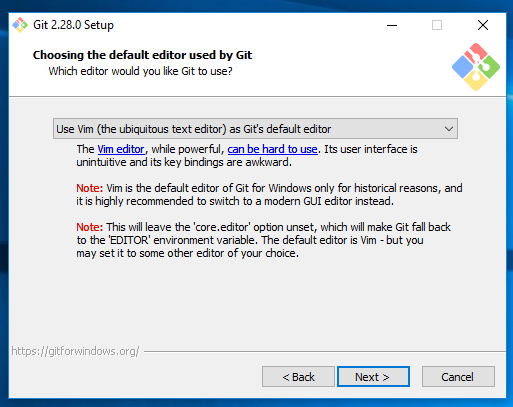

# Part 1, Lesson 1: Installing Git

The first step to using Git is, of course, to install it. It may already be installed on your
system. We'll check first.

* [Windows](#windows)
* [Mac](#mac)
* [Linux](#linux)


## Windows
### Is it installed?

There are two ways to check if it is installed:

1. Type "Git" in your search box. If you see "Git GUI" and "Git Bash" as options, it is installed.
2. Right click in the main area of the file explorer as shown below. If you see "Git GUI" and
   "Git Bash" in the context menu, it is installed.


Note that this is also the easiest way to launch Git Bash (which is what we will be using). When
you launch it via the right-click menu, the bash terminal starts in this folder.

### Installing

To install, download the Windows package from https://git-scm.com/downloads. Launch the installer like a
normal Windows installer.

The first page of the installer will pop up with a number of options to enable or disable.


The three you definitely want checked are:

* Git Bash Here
* Git GUI Here
* Associate .git* configuration files with the default text editor

You may uncheck Git LFS if you want, but it doesn't interfere with anything, so I would leave it checked.
The "Associate .sh files to be run with Bash" is one you should uncheck if you already have `.sh` files
that should be run with something else - this is uncommon for Windows, so it's usually okay to leave it
checked.

The next page will ask what editor you want to use for your commit messages. The default (vim) is, as the
warning says, not very intuitive. I recommend choosing one of the other editors, which are normal GUI editors
(whereas vim is in the terminal). If you already have one of the ones listed installed, use that. Otherwise,
[Notepad++](https://notepad-plus-plus.org/) is the most lightweight and so will launch the quickest. If you
don't use any of the other ones, then I recommend Notepad++. **Note:** you won't be able to click "Next" if
you have selected an editor that is not installed. In that case, cancel the Git installation, install your
desired editor, then try Git again.




There will be several more dialogues, I recommend keeping the defaults for all of them.

* [Next lesson: global configuration, creating a repo, and first commits](2-setup-and-first-commit.html)
* [Back to the introduction](../0-introduction.html)

## Mac
### Is it installed?

Open your Terminal. The easiest way is to do a Spotlight search (with `Cmd+Spacebar`) and search for "Terminal" - 
it'll be the one with a mostly black box as an icon. When it launches, type `git --version`. If it prints something
like `git version 2.28.0` on the next line (your number may differ), then it is installed. If it prints 
`git: command not found` then you will need to install it.

### Installing

The main Git page for Mac (https://git-scm.com/download/mac) gives several options. Although installing via
[Homebrew](https://brew.sh/) is the first option, if you don't have Homebrew already installed, that might be
more than you want to deal with. (I will say, having Homebrew installed can be very helpful in data science.)
Either the Xcode or binary installer methods are easiest. The binary installer is just like any other app installer.
To install with Xcode, in the Terminal type:

```
xcode-select --install
```

and this should install Git along with some other command line tools. **Note:** you do *not* need the full Xcode
package, only the command line tools.

* [Next lesson: global configuration, creating a repo, and first commits](2-setup-and-first-commit.html)
* [Back to the introduction](../0-introduction.html)


## Linux
### Is it installed?

Most Linux distributions come with Git preinstalled. You can check by opening your Terminal and typing
`git --version`. If it prints something like `git version 2.28.0`, then it is installed. If you see
`git: command not found` *or* something like `The package git is not installed. You can install it with...`,
then it needs installed. 

### Installing

The main Git Linux downloads page (https://git-scm.com/download/linux) lists how to install it for many Linux
distributions. In all cases you will install it through your package manager (e.g. `apt`, `yum`, etc.)

* [Next lesson: global configuration, creating a repo, and first commits](2-setup-and-first-commit.html)
* [Back to the introduction](../0-introduction.html)