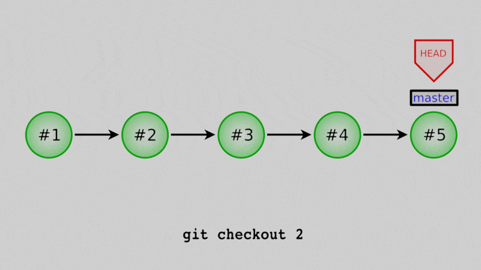
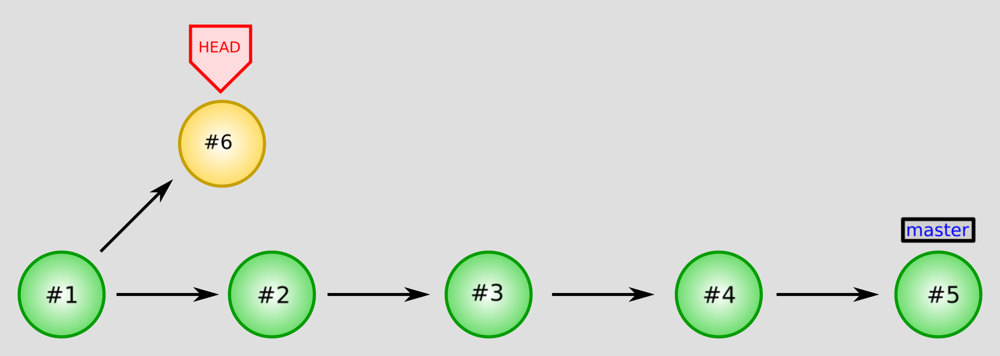
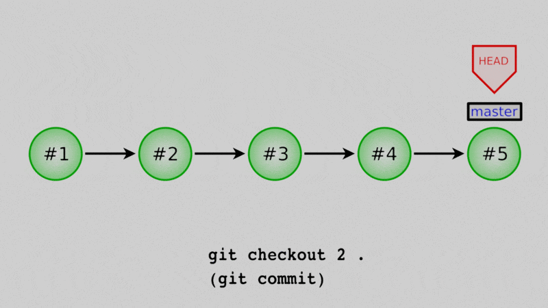
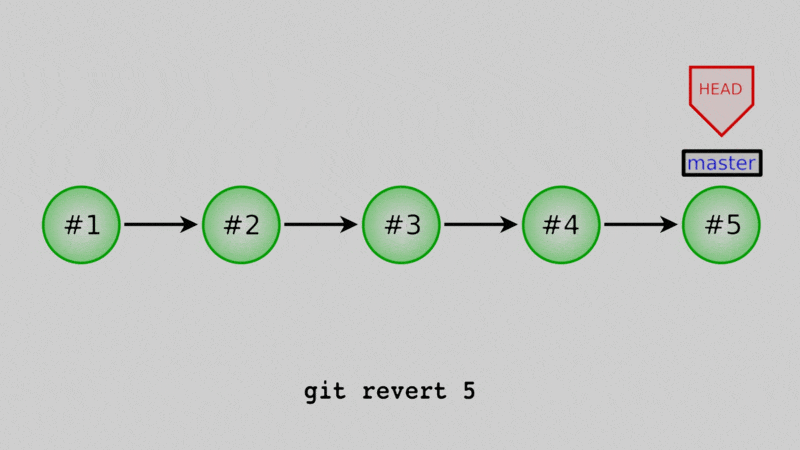
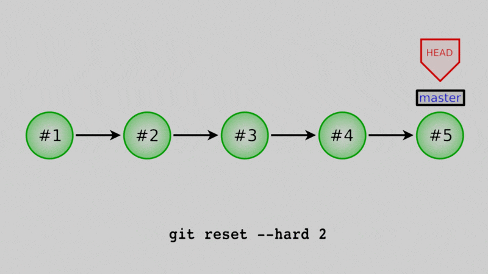

# Part 1, Lesson 6: going back to old commits

**Lesson goal:** learn how to go back to old commits, in whole or in part

**Git commands:**

* `git checkout` to move to an old commit
* `git restore` to bring back files from old commits
* `git revert` to undo past commits
* `git reset --hard` to completely reset to old commits (*dangerous!*)

**Git concepts:**

* A *detached head state* occurs when you have checked out a commit that is not a branch
  tip (the last commit on a branch). New commits made in this state won't belong to any
  branch.
* A *commit hash* is a unique identifier for a commit. It is the gibberish string of numbers
  and the letters a-f included in the log entry for each commit.

**Downloads:**

* [The repo from the end of lesson 5](./demo-files-l6.zip)

## Introduction

One of the best things about any version control system is that it lets you go back to old
versions of your code very easily. In fact there's at least four different ways to go back
to old code in Git! You can:

1. Switch back to an old commit temporarily
2. Bring back old versions of a file or files - including the whole repo
3. "Undo" a recent commit
4. Completely reset to an old commit (which is dangerous)

We'll go through each one individually first, and then discuss the pros and cons of each at 
the end.

<div class="aside">
Something you will see in each case is that we can only bring a file back to where it was
in a previous commit - there's no way to go "halfway" between commits without some manual
work. That can help you decide how often to make commits. One natural guide you can use for
when to commit is, *Would I want to come back to this version of the code?* If the answer 
is yes, commit!
</div>


## Method 1: temporarily check out an old commit

The easiest way is to just check out an old version of your code, temporarily. If we visualize
the repo, it would look something like this:



In Lesson 3, we mentioned the `HEAD` as just the most recent commit. That was a little white lie,
really, the `HEAD` is a reference to some commit. Whichever commit `HEAD` points to is the one that
the code in your working directory is based off of. One way I think about it is that the files that
I actually see in the repo are the sum of three things:

1. The version of them in the commit pointed to by `HEAD`
2. Changes staged into the index
3. Changes made but not staged or committed

If we change what commit `HEAD` points to, we change what the files in our repo look like. But, because I
did not move the `master` branch (for now just think of it as another reference), it's a very temporary
change, easy to undo. Let's see that.

Last time we deleted both of the files in our repo. What if we wanted to go back to before that deletion?
The first thing we need to know is some identifier for the commit we want to go back to. We can get this
from the log:

```
$ git log --oneline
6220de2 (HEAD -> master) Deleted daysofweek.txt
13c6a9d Stopped tracking months.txt
435350c Added comments to daysofweek.txt and months.txt.
4cc58be Put Sunday at the end of the week
50be39a Changed all days and months to 3 letter abbreviations
09685d8 Abbreviate June and July in months.txt
e8e99aa Added daysofweek.txt and months.txt
```

Here I've used the `--oneline` flag to make each log message just one line. On each line, the first 7 characters
are a short version of the commit hash. These hashes are a completely unique identifier for a commit. They are
so unique that even if you've done exactly the same commits I have, your hashes will be different.

Now looking at these messages, I know that the commit I want is "Added comments to daysofweek.txt and months.txt",
because that's the last one before I started deleting/untracking things. For me, its commit hash is `435350c` 
(for you it will be different, so be sure to use yours in the `git checkout` command below.)

Right now, if I list the files in my repo, there are none:

```
$ ls
 
```

But we can *checkout* our chosen commit like this:

```
$ git checkout 435350c
Note: switching to '435350c'.

You are in 'detached HEAD' state. You can look around, make experimental
changes and commit them, and you can discard any commits you make in this
state without impacting any branches by switching back to a branch.

If you want to create a new branch to retain commits you create, you may
do so (now or later) by using -c with the switch command. Example:

  git switch -c <new-branch-name>

Or undo this operation with:

  git switch -

Turn off this advice by setting config variable advice.detachedHead to false

HEAD is now at 435350c Added comments to daysofweek.txt and months.txt.
```

If I list my files:

```
$ ls
daysofweek.txt  months.txt
```

they're back! And if I look at one:

```
$ cat daysofweek.txt 
# English days-of-week
Mon
Tue
Wed
Thu
Fri
Sat
Sun
```

it's the version we expect. We can look around here, see what our files looked like,
even run the code in this state. But this is not a permanent change; this is not the
way to undo later changes. When we're done, we can use the same command to go back.
The only difference is to get back to normal we want to use `master` as our reference,
not the commit hash:

```
$ git checkout master
Previous HEAD position was 435350c Added comments to daysofweek.txt and months.txt.
Switched to branch 'master'
```

If we list our files, you'll see nothing once more:

```
$ ls
 
```

### What's with that big long warning? And why checkout master to go back?

The short answer is if we `git checkout` a specific commit and not a branch, 
then we risk losing any new commits we make. If that's enough explanation for you,
feel free to skip to the next section.

The longer answer is that when you type `git log`, it doesn't show you every commit -
only those that are "ancestors" of `HEAD`, by default. If you checkout an old commit
(just like we did above) and do `git log --oneline`, you'll only see commits up to
the one you checked out, not later ones. Now, even though we can't see them in log,
because one of them is pointed to by `master`, it's easy to get back to them. There
are ways to list all branches (`git branch`) so we can always find the branch name to
use to get back to our previous state.

But, if you "detach" the HEAD by checking out a specific *commit* rather than a *branch*,
(which is exactly what we just did above), any new commits won't be a direct ancestor of
a branch. It would look like this:



Commit #6 splits off of #1, **but** there's no way to get from the commit marked with `master`
to #6 by going backwards along arrows (we'd have to go forward along the arrow between #1 and #6.)
This means #6 is not an ancestor to `master` or any other named reference except `HEAD`, so 
if we move `HEAD` back to `master`, the log won't show #6 unless we remember its commit
hash, and so #6 will effectively be lost

That's why you get that big warning - so you know any new commits you make in detached head
mode can be easily lost if you're not careful. It's also why we need to use `git checkout master`
to get back to the "normal" mode, and can't do `git checkout <commit hash for master>`. The
first one "connects" us to the master branch again so that new commits are in that branch.
The second one is still a detached head because we checked out a commit, and not a branch,
so the same problems apply.

<div class="aside">
The tribulations of #6 are actually more severe than just "it's hard to remember its hash."
After all, you could write it down and get around that. But Git will eventually clean up
commits that aren't ancestors of any reference, so you could actually lose that commit.
Just don't leave useful work in orphan commits like this! It's the safest approach.
</div>

## Method 2: restore files from a previous commit

Okay, let's say that we want `daysofweek.txt` back for good. One way is to actually just
copy the old state of the files from a previous commit and overwrite them in our working
directory. We can then create a new commit with those old versions in place.



How do we do that? We can use `git restore` to resurrect any file or files from old commits. 
Once again we need the commit hash:

```
$ git log --oneline
6220de2 (HEAD -> master) Deleted daysofweek.txt
13c6a9d Stopped tracking months.txt
435350c Added comments to daysofweek.txt and months.txt.
4cc58be Put Sunday at the end of the week
50be39a Changed all days and months to 3 letter abbreviations
09685d8 Abbreviate June and July in months.txt
e8e99aa Added daysofweek.txt and months.txt
```

I'm going to get it from the same commit as we just checked out (`435350c`). So to restore
`daysofweek.txt`, I'll do:

```
$ git restore --source 435350c daysofweek.txt
$ git status
On branch master
Untracked files:
  (use "git add <file>..." to include in what will be committed)
	daysofweek.txt

nothing added to commit but untracked files present (use "git add" to track)
```

The commit hash must go right after the `--source` option, followed by the file (or files)
we want to restore.

Notice that it doesn't say anything right away, but if we check `git status` we see that
`daysofweek.txt` is back, but *not* tracked. All `git restore` does is bring the contents
of the specified version of the file, it doesn't do anything to change whether it is tracked
or not.

We can actually use `git restore` to get the entire repo from and old commit. I'll delete
`daysofweek.txt` again (`rm daysofweek.txt`), and then this time do:

```
$ git restore --source 435350c .
$ git status
On branch master
Untracked files:
  (use "git add <file>..." to include in what will be committed)
	daysofweek.txt
	months.txt

nothing added to commit but untracked files present (use "git add" to track)
```

Our second restore command is very similar, except now instead of a file name, we use `.`
which stands for "this directory". (So if your repo has subdirectories, make sure you're
in the top one when you issue this command - unless you want to just restore your current
subdirectory that is.)  Once again we see that the files aren't tracked. If we look them over
and decide we want these versions of the file in the repo again, we can commit them like normal:

```
$ git add *.txt
$ git commit -m 'Restored daysofweek.txt and months.txt'
```

<div class="aside">
You can use this even if the file(s) you want to restore exist in the repo right now, that is
if we decided now that we wanted an even earlier version of `daysofweek.txt`, we could certainly
use `git restore` to grab that. But, *make sure you don't have any uncommitted changes*
to those files you want to restore because they'll be lost faster than you can say "Oops."
</div>


## Method 3: reverting a recent commit

You can also "undo" existing commits by creating a new commit that is exactly the negative of the
commit to undo. For this we use `git revert`, followed by the commit to undo. 



Let's say that, oh darn - we actually don't want these two files in our repo! Why did we readd them?
Well let's undo the commit that we just did. Again, use the log to get the commit hash:

```
$ git log --oneline
31a3fcf (HEAD -> master) Restored daysofweek.txt and months.txt
6220de2 Deleted daysofweek.txt
13c6a9d Stopped tracking months.txt
435350c Added comments to daysofweek.txt and months.txt.
4cc58be Put Sunday at the end of the week
50be39a Changed all days and months to 3 letter abbreviations
09685d8 Abbreviate June and July in months.txt
e8e99aa Added daysofweek.txt and months.txt
```

For me it's `31a3fcf`. To undo it, we just do:

```
$ git revert 31a3fcf
Removing months.txt
Removing daysofweek.txt
[master aea894d] Revert "Restored daysofweek.txt and months.txt"
 2 files changed, 21 deletions(-)
 delete mode 100644 daysofweek.txt
 delete mode 100644 months.txt
 ```

 It'll pop up with an opportunity to enter a commit message - but it provides a fine default.
 Save that message and exit the text editor to finish the revert. Now if we look at our log
 again:

 ```
 $ git log --oneline
aea894d (HEAD -> master) Revert "Restored daysofweek.txt and months.txt"
31a3fcf Restored daysofweek.txt and months.txt
6220de2 Deleted daysofweek.txt
13c6a9d Stopped tracking months.txt
435350c Added comments to daysofweek.txt and months.txt.
4cc58be Put Sunday at the end of the week
50be39a Changed all days and months to 3 letter abbreviations
09685d8 Abbreviate June and July in months.txt
e8e99aa Added daysofweek.txt and months.txt
```

there's a new commit, and if we list the files:

```
$ ls
 
```

once again we have an empty directory. 

<div class="aside">
We can actually undo multiple commits at once. For example, if I wanted to revert clear back to `50be39a`
(my third commit) instead of undoing just one commit, I could do: `git revert 50be39a..31a3fcf`. The `..`
creates a range of commits. However, this will create one negative commit for each commit to undo. If you
need to undo a lot of work, I'd use `git restore --source=<commit> .` instead - it's cleaner.
</div>

One thing to know about `revert` - it works best to undo the last commit or the last few commits. Trying
to undo one commit from farther back in your history can be done - but expect Git to need your help figuring
out how exactly. If I try to undo my second commit, the problem is the repo now looks very little like it
did right after that commit, so Git won't know how to do the undo.


## Method 4: resetting

Well this is embarrassing, we have two commits that taken together don't do anything. Seems silly, why not
just erase those commits? We *can*, but know that this approach has more risk than the other three. 



If we use `git reset --hard` while we have the master branch checked out, we will actually move the branch
back to an old commit, and any commits after that won't be part of the branch history. They'll still exist
in the repo (for a little while anyway) but are hard to recover and will eventually be deleted for good.

Let's say that we realize that deleting these files was a terrible mistake and all this messing around
has just muddied our commit history too much. We can reset to the commit before we deleted `months.txt`
for the first time by first finding the commit hash with the log:

```
$ git log --oneline
aea894d (HEAD -> master) Revert "Restored daysofweek.txt and months.txt"
31a3fcf Restored daysofweek.txt and months.txt
6220de2 Deleted daysofweek.txt
13c6a9d Stopped tracking months.txt
435350c Added comments to daysofweek.txt and months.txt.
4cc58be Put Sunday at the end of the week
50be39a Changed all days and months to 3 letter abbreviations
09685d8 Abbreviate June and July in months.txt
e8e99aa Added daysofweek.txt and months.txt
```

(it's `435350c` for me), and then use `git reset` like this:

```
$ git reset --hard 435350c
HEAD is now at 435350c Added comments to daysofweek.txt and months.txt.

$ ls
daysofweek.txt  months.txt
```

Our files are indeed back and if we look at the log now:

```
$ git log --oneline
435350c (HEAD -> master) Added comments to daysofweek.txt and months.txt.
4cc58be Put Sunday at the end of the week
50be39a Changed all days and months to 3 letter abbreviations
09685d8 Abbreviate June and July in months.txt
e8e99aa Added daysofweek.txt and months.txt
```

we've erased the four commits since the end of Lesson 4.

### This is so much cleaner! Why do you say it's dangerous?

The problem is this is effectively permanent. If we decided later we wanted those four commits back, 
it's pretty tricky to do. It also robs future users of the repo of the full history. That's not so
evident in this simple example, but consider a real world example: you have code that's really, really
slow, so you try to optimize it to run faster. You spend a week or two on it, and it is faster, but it
doesn't give the right answer anymore. Eventually you decide to scrap the optimization and go back to
the slow but correct way.

Now, odds are, if you came up with that approach to optimize it, someone else in the future might. (It
might even be yourself in six months.) If you use `git reset` to pretend that attempt never happened,
then there's no record of it. If instead you use one of the other solutions, there's at least one commit
in the history that says "Oops, bad idea - don't do this." Seeing that commit could save future users
time.

There's one more reason `git reset` is dangerous that comes in when you start using remotes to share
your repo (that'll be Part III). Basically once a commit has been sent to a remote, it might accidentally
reenter the history if just one person who uses that repo doesn't do the reset. In that case, resetting will
actually make the history more confusing - but more on that in Part III.

## Choosing a method

Which method should you use to go back to an old version of the code? Well:

* **Use Method 1 (checkout old commit)** if you just want to go back and look at the code temporarily
  or do some test runs with it. This is great if you want to compare old results with new results to
  (for example) make sure you didn't inadvertently change your analysis when you added a new feature.
* **Use Method 2 (restore old versions of files)** if you want to permanently go back to how the repo
  was in an old commit. This would be the case if, say, you tried to make the code faster and it didn't
  work.
* **Use Method 3 (undo a commit)** if it's easier to say which commit you want to undo than exactly what
  version you want to go back to. This is good if, for example, one commit a little bit back in the repo
  introduced a bug that needs taken out, but you want to keep other changes after that.
* **Don't use Method 4 (hard reset).** I included Method 4 because it *always* comes up when you search
  online for "undo a Git commit", and I want you to be aware that it exists, but it is dangerous. There 
  are good reasons to use it, but at this stage in your Git learned, it's best to just steer clear.

* [Previous lesson: removing/untracking files](5-removing-files.html)